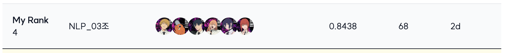
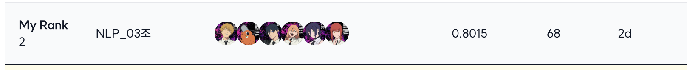
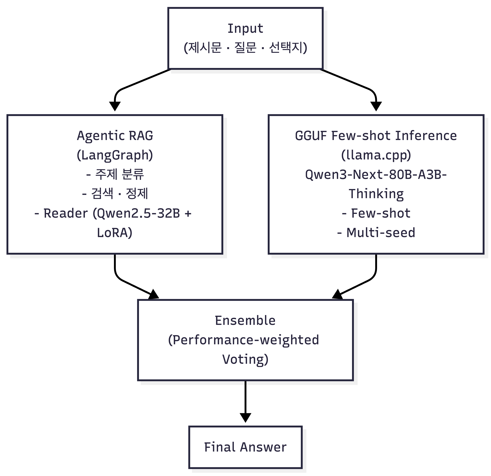

<div align='center'>

# 🏆 NLP Project : 수능 문제 풀이 AI 모델 생성

</div>

## ✏️ 대회 소개

|    특징     | 설명                                                                                                                         |
| :---------: | ---------------------------------------------------------------------------------------------------------------------------- |
|  대회 주제  | 네이버 부스트캠프 AI-Tech 8기 NLP 트랙의 Generation for NLP 대회<br/>                                                        |
|  대회 설명  | 한국어의 특성과 수능 시험의 특징을 바탕으로 수능에 특화된 AI 모델을 생성하는 프로젝트                                        |
|  진행 기간  | 2025년 12월 17일 ~ 2026년 1월 6일 (3주)                                                                                      |
| 데이터 구성 | 학습데이터 셋: KMMLU / MMMLU(Ko) / KLUE MRC 중 2031개</br>평가데이터 셋: 수능형 문제 + KMMLU / MMMLU(Ko) / KLUE MRC 총 869개 |
|  평가 지표  | Macro F1-score = (각 클래스별 F1-score의 합) / 클래스 수                                                                     |
|  랩업 리포트 | [Gen for NLP NLP-03 랩업 리포트](https://github.com/boostcampaitech8/pro-nlp-generationfornlp-nlp-03/blob/main/assets/Gen%20for%20NLP_NLP-03.pdf) |


## 🎖️ Leader Board

### Public Leader Board (4위)



### 🥈 Priavate Leader Board (2위)



## 👨‍💻 Contributors

<table align='center'>
  <tr>
    </td>
        <td align="center">
      <br>
      <a href="https://github.com/choijunho-AIDeveloper">
        
      </a>
    </td>
    <td align="center">
      <br>
      <a href="https://github.com/kyunhui">
        
      </a>
    </td>
    <td align="center">
      <br>
      <a href="https://github.com/Parkseojin2001">
        
      </a>
    </td>
    <td align="center">
      <br>
      <a href="https://github.com/shihtzu-918">
        
      </a>
    </td>
    <td align="center">
      <br>
      <a href="https://github.com/2sseul">
        
      </a>
    </td>
    <td align="center">
      <br>
      <a href="https://github.com/hyejinw">
        
      </a>
  </tr>
</table>

## 👼 역할 분담

| 이름   | 역할                                                                                                         |
| ------ | ------------------------------------------------------------------------------------------------------------ |
| 최준호 | Agentic RAG 구성 및 적용, 프롬프트 엔지니어링, RAG 데이터 구성                                               |
| 김윤희 | 데이터 EDA 및 증강, Unsloth 기반 모델링, gguf 포맷 기반 Few-Shot inference, Agentic RAG 구성 및 적용         |
| 박서진 | Baseline Code 분석, Unsloth 기반 모델 학습 및 성능 분석, CoT 프롬프트 엔지니어링, RAG와 추론모델 통합        |
| 곽나영 | Baseline Code 분석 및 코드 모듈화, 데이터 수집 및 증강, 학습 데이터 임베딩 분석, Unsloth 기반 모델링, 앙상블 |
| 김이슬 | Baseline Code 분석, streamlit 시각화, 모델 학습 및 성능 분석, RAG 구현 및 성능평가, Agentic RAG 구성 및 적용 |
| 우혜진 | 데이터 EDA 및 증강, Few-Shot 프롬프팅, gguf inference, 앙상블                                                |

## ✍🏻 프로젝트 개요

본 프로젝트는 수능형 객관식 문제를 해결하기 위해 개발된 앙상블 시스템입니다. Qwen 모델과 Agentic RAG, GGUF 기반 추론을 결합하여 고품질의 답변 생성을 목표로 합니다.

### 주요 특징

- **Agentic RAG System**: LangGraph 기반 다단계 검색 및 추론 파이프라인

  - Subject Finder: 문제 주제 자동 분류
  - Query Generator: 다중 검색 쿼리 생성
  - FAISS Vector Store: BGE-M3 임베딩 기반 의미론적 검색
  - Score & Refine: 검색 결과 품질 평가 및 재검색
  - Few-shot Learning: 유사 문제 예시 활용

- **Qwen Fine-tuning**: Unsloth 기반 효율적인 LoRA 학습

  - DoRA + RSLoRA 적용
  - Gradient Checkpointing
  - 4-bit Quantization 지원

- **GGUF Inference**: llama.cpp 기반 경량 추론

  - Qwen3-Next-80B-A3B-Thinking 모델 사용
  - Few-shot 프롬프팅
  - 다중 시드 앙상블

- **Ensemble Strategy**: 다중 모델 결과 투표 방식 결합

### 📃 시스템 아키텍처



## 📁 폴더 구조

```
pro-nlp-generationfornlp-nlp-03-main/
├── config/                    # 설정 파일
│   └── config.yaml
├── rag/                       # Agentic RAG 모듈
│   ├── agent.py              # LangGraph 에이전트 구현
│   ├── chunker.py            # 문서 청킹
│   ├── upload_to_faiss.py    # FAISS 벡터 DB 구축
│   ├── upload_to_chroma.py   # ChromaDB 구축
│   ├── upload_to_pinecone.py # Pinecone 업로드
│   ├── prompt/               # RAG 프롬프트
│   ├── data/                 # RAG 데이터
│   └── requirements.txt
├── gguf/                      # GGUF 추론 모듈
│   └── inference_fewshot.py  # Few-shot 추론 스크립트
├── datacollator/              # 데이터 전처리 및 학습
│   ├── train.py              # 학습 스크립트
│   ├── train_no_datacollator.py
│   ├── train_resume.py       # 체크포인트 재개
│   ├── inference.py          # 추론 스크립트
│   ├── inference_prod.py     # 프로덕션 추론
│   ├── data_utils.py         # 데이터 전처리
│   ├── prompt_utils.py       # 프롬프트 관리
│   ├── config.py             # 학습 설정
│   └── requirements.txt
├── src/                       # 핵심 모듈
│   ├── model.py              # 모델 래퍼
│   ├── dataset.py            # 데이터셋 처리
│   ├── utils.py              # 유틸리티 함수
│   └── prompt_template.py    # 프롬프트 템플릿
├── main.py                    # 메인 실행 스크립트
└── assets/                    # 리소스 파일
```

## 💻 설치

### 기본 환경

```bash
pip install -r datacollator/requirements.txt
pip install -r rag/requirements.txt
```

### RAG용 FAISS 설치

```bash
pip install faiss-gpu  # GPU 사용 시
# 또는
pip install faiss-cpu  # CPU 사용 시
```

### GGUF 추론용 llama.cpp 설치

```bash
git clone https://github.com/ggerganov/llama.cpp
cd llama.cpp
make LLAMA_CUDA=1  # GPU 사용 시
# 또는
make  # CPU 사용 시
```

## 사용법

### 1. Agentic RAG 파이프라인

#### 1.1 문서 벡터화

```bash
cd rag
python upload_to_faiss.py
```

#### 1.2 RAG 추론 실행

```bash
python agent.py
```

**주요 설정**:

- `model_id`: Qwen2.5-32B-Instruct-bnb-4bit
- `max_seq_length`: 8192
- `temperature`: 0.1
- `topk`: 3 (검색 결과 개수)
- `threshold`: 0.65 (재검색 임계값)

#### 1.3 Agent 워크플로우

1. **Subject Finder**: 문제 주제 분류 (한국사, 경제, 철학, 과학기술, 사회과학, 인문학, 문학)
2. **Query Generator**: 다중 검색 쿼리 생성
3. **Retrieval**: FAISS에서 관련 문서 검색
4. **Score Retrieval**: 검색 결과 품질 평가 (유사도 0.7 + validity 0.3)
5. **Refine Search**: 점수가 낮으면 쿼리 개선 후 재검색 (최대 3회)
6. **Generate**: 최종 답변 생성

### 2. Qwen 모델 학습

#### 2.1 기본 학습

```bash
python main.py --config ./config/config.yaml --task train
```

#### 2.2 체크포인트에서 재개

```bash
cd datacollator
python train_resume.py
```

#### 2.3 학습 설정 (config.yaml)

```yaml
model:
  experiment_name: "Qwen2.5-32B-Instruct-bnb-4bit"
  train:
    model_name: "unsloth/Qwen2.5-32B-Instruct-bnb-4bit"

peft:
  r: 64
  lora_alpha: 32
  use_dora: True
  use_rslora: True

UnslothTrainingArguments:
  per_device_train_batch_size: 2
  gradient_accumulation_steps: 16
  num_train_epochs: 3
  learning_rate: 5e-5
  lr_scheduler_type: "cosine"
  optim: "adamw_8bit"
```

### 3. GGUF Few-shot 추론

#### 3.1 llama-server 실행 (별도 터미널)

```bash
export LD_LIBRARY_PATH=/usr/local/cuda/lib64:$LD_LIBRARY_PATH
./llama.cpp/build/bin/llama-server \
  -m ./models/Qwen3-Next-80B-A3B-Thinking-UD-Q3_K_XL.gguf \
  -c 32768 \
  -np 2 \
  -cb \
  -fa on \
  --port 8000 \
  --host 0.0.0.0
```

#### 3.2 추론 실행

```bash
cd gguf
python inference_fewshot.py
```

**주요 설정**:

- `CTX_SIZE`: 32768 (Context window)
- `MAX_TOKENS`: 6000 (출력 최대 토큰)
- `NUM_LOOPS`: 2 (앙상블용 반복 횟수)
- `temperature`: 1.0
- Few-shot 예시 3개 자동 삽입

### 4. 모델 추론

#### 4.1 테스트 데이터 추론

```bash
python main.py --config ./config/config.yaml --task test
```

#### 4.2 검증 데이터 추론

```bash
python main.py --config ./config/config.yaml --task test --valid True
```

#### 4.3 추론 모드 선택

```bash
# Logit 기반 추론 (기본)
python main.py --task test --mode logit

# Generate 기반 추론
python main.py --task test --mode generate
```

## 모델

- **Reader (RAG)**: unsloth/Qwen2.5-32B-Instruct-bnb-4bit
- **Reader (Fine-tuned)**: Qwen2.5-32B-Instruct + LoRA
- **GGUF**: Qwen3-Next-80B-A3B-Thinking-UD-Q3_K_XL
- **Embedding**: BAAI/bge-m3
- **Vector Store**: FAISS (주제별 7개 DB)

## 참고자료

- [Unsloth](https://github.com/unslothai/unsloth) - 효율적인 LLM Fine-tuning
- [LangGraph](https://github.com/langchain-ai/langgraph) - Agent 워크플로우 프레임워크
- [llama.cpp](https://github.com/ggerganov/llama.cpp) - GGUF 추론 엔진
- [BGE-M3](https://huggingface.co/BAAI/bge-m3) - 다국어 임베딩 모델
- [Qwen](https://github.com/QwenLM/Qwen) - Alibaba 오픈소스 LLM
